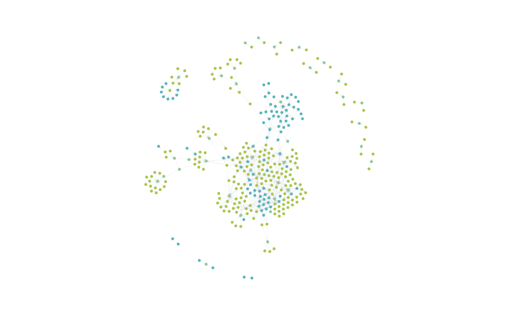

# Codebase GraphRAG
[Work In Progress]



## About the project
### Router LLM
- Semantic search + graph retrieval: Vector embedding similarity augmented with graph query to retrieve relevant nodes...
- Graph Cypher queries: Used to traverse and extract relevant information from the Knowledge Graph based on context and semantic relationships.
- Conversation memory: Maintains context throughout user interaction, enabling effective and continuous dialogue.

### Knowledge graph configuration
The codebase is modeled as a knowledge graph. Inside the knowledge graph, Class, Function and Method definitions are modeled as nodes in the Knowledge Graph. Dependencies in the form of CALL, INHERITS_FROM and NESTED_IN are modeled as relationship or edges. Explicit import links from within the project are ignored, modeled as a direct relationship from CALL context to -> DEFINITION context.

### Notes
- The parsing of code ignores files inside any folder called tests.

## Technologies
- **Neo4j Aura**: Managed Neo4j service used as the Knowledge Graph database.
- **Cypher**: Query language used for graph retrieval in Neo4j.
- **OpenAI API**: Provides embeddings and LLM responses.
- **LangChain**: Framework facilitating RAG and LLM integration.
- **Astral UV**: Dependency management tool.
- **Streamlit**: User-friendly interactive web frontend.

## Packages

## Instructions
### Installation
This project uses Astral's UV to manage dependencies. Using UV, the both sstatic and dynamic dependencies are robustly handled by the uv.lock file.

To install the project dependencies simply execute from the command-line:
```bash
uv sync
```
UV will automatically create a virtual environment with the necessary dependencies.

### Configuration
- If desired, modify `src/utils/config/config.py` to modify the fields and properties for Vector Index and Code Embedding in Neo4j.
- The prompts for each chain can be modified for finer prompt engineering in the file `src/utils/config/prompts.yaml`

### Usage
- Run streamlit with uv from the root folder as 
    ```bash
    uv run streamlit run streamlit.py
    ```
- Insert API Keys and Aura DB credentials on the sidebar. None of them are stored as you can check on the `streamlit.py` code. Aura DB offers a free tier account that you can use and is more than enough for most codebases.
- Insert your project's code as a ZIP or RAR file on the *Codebase RAG Source* section. Knowledge Graph creation from the codebase and push to Neo4j may take a while, depending on project size. Once the Knowledge Graph has been uploaded to Neo4j, the Chatbot has your code project inside his brain 🧠!
- If desired, you can choose the OpenAI model to use with the Chatbot.
- You can now ask the chat questions like "What pieces of the code would I have to modify to adapt for changes in the X method from the Y class?"


## Next steps
- Create unit tests
- Refactor project to divide in 3 to separately deployments; 
    1. Code database creation [Work in Progress]
    2. RAG LLMs 
    3. Frontend app 
- Refactor graph build and upload to Neo4j processes to asynchronous and parallel to make the RAG knowledge base creation faster. 
- Adapt for private LLM endpoint integration
- Add option to plug in official code documentation
- Model file structure on top of the code interactions.